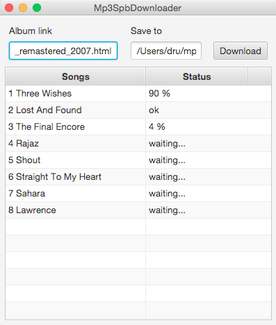

# Mp3SpbDownloader
Desktop cross platform java (require java 8 installed) application, that helps download full albums from musicmp3spb.org. Not official. Just my project for fun.

Отблагодарить и поспособствовать развитию можно так / donations

## How to run:

Download `mp3spb-downloader-assembly-x.jar` from [releases](https://github.com/zella/Mp3SpbDownloader/releases)

Click on jar file, like regular executables.

If it's not working, run from terminal:

    java -jar mp3spb-downloader-assembly-x.jar

